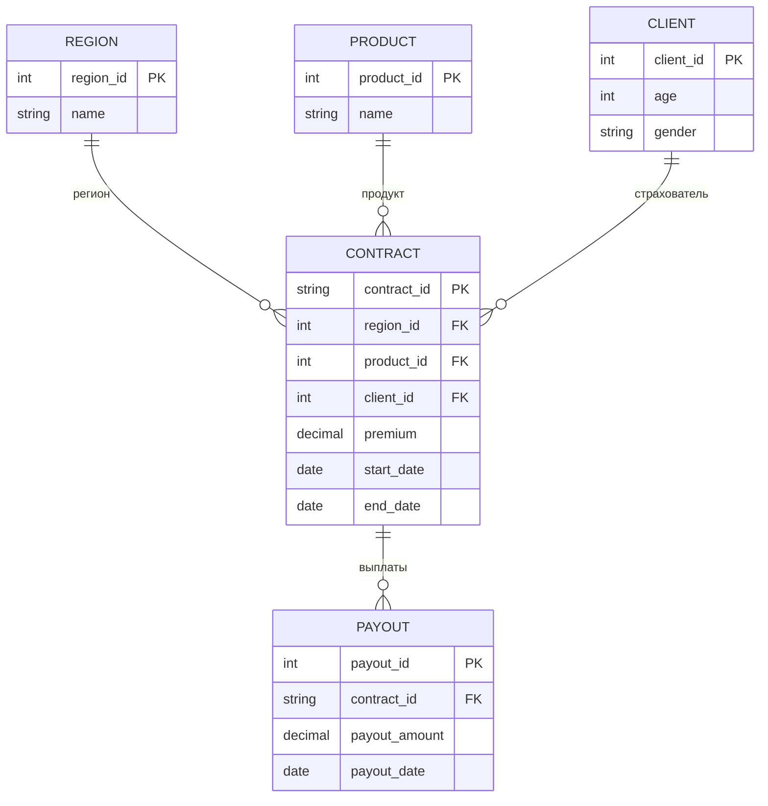

# Актуарный дашборд

MVP-приложение для актуарного анализа страховых данных. Построено на Streamlit и предназначено для визуализации премий, выплат, убыточности и сезонности по портфелю страховых договоров.

---

## Содержание

1. [Назначение](#назначение)
2. [Архитектура](#архитектура)
3. [Как работает приложение](#как-работает-приложение)
4. [Модель данных](#модель-данных)
5. [Слой данных](#слой-данных)
6. [Актуарные расчёты](#актуарные-расчёты)
7. [Страницы дашборда](#страницы-дашборда)
8. [Фильтры и состояние](#фильтры-и-состояние)
9. [Кэширование и производительность](#кэширование-и-производительность)
10. [Структура проекта](#структура-проекта)
11. [Установка и запуск](#установка-и-запуск)
12. [Подключение Oracle](#подключение-oracle)
13. [Технологии](#технологии)

---

## Назначение

Дашборд решает задачи актуарного анализа страхового портфеля:

- оценка собранных премий и произведённых выплат;
- расчёт коэффициента убыточности (loss ratio);
- анализ частоты страховых случаев;
- сравнение регионов и продуктов;
- выявление сезонных паттернов;
- прогнозирование премий на ближайшие периоды;
- детальный просмотр отдельных договоров.

Для MVP используются **10 000 синтетических договоров** в SQLite. При необходимости источник данных можно переключить на **Oracle**.

---

## Архитектура

Приложение построено по трёхслойной схеме:

```
┌─────────────────────────────────────────────────────────┐
│                    UI (Streamlit)                      │
│  app.py + pages/1..5 + навигация/стили (utils/ui.py)   │
│            + сайдбар с фильтрами (utils/loader.py)     │
└──────────────────────────┬──────────────────────────────┘
                           │ load_filtered_data()
┌──────────────────────────▼──────────────────────────────┐
│                   Бизнес-логика                        │
│  utils/calculations.py + utils/formatters.py           │
│  utils/aggregations.py (единый источник агрегаций)     │
└──────────────────────────┬──────────────────────────────┘
                           │ get_contracts(filters)
┌──────────────────────────▼──────────────────────────────┐
│                    Слой данных                           │
│  data/database.py (SQLite)  │  data/oracle_connector.py  │
│  data/generator.py (тестовые данные)                     │
└──────────────────────────────────────────────────────────┘
```

**Поток данных при открытии страницы:**

1. Пользователь задаёт фильтры в боковой панели.
2. Фильтры сохраняются в `st.session_state`.
3. `load_filtered_data()` запрашивает данные из SQLite (или Oracle) с учётом фильтров.
4. Страница агрегирует DataFrame и строит графики Plotly.
5. Метрики форматируются через `utils/formatters.py`.

---

## Как работает приложение

### Первый запуск

При первом обращении к базе срабатывает функция `ensure_data_loaded()` из `data/database.py`:

1. Создаётся файл `actuary_data.db` и нормализованные таблицы (`regions`, `products`, `clients`, `contracts`, `payouts`). Если обнаружена устаревшая денормализованная схема — выполняется автоматическая миграция.
2. Если база пуста — вызывается `DataGenerator` (10 000 договоров), затем `insert_data` раскладывает данные по таблицам.
3. Запись выполняется через SQLAlchemy.

Повторная генерация **не выполняется**, пока файл базы существует и таблица `contracts` не пуста.

### Запуск сервера

Приложение — это **Streamlit-приложение**, а не обычный Python-скрипт:

```powershell
streamlit run app.py
```

> **Важно:** команда `python app.py` не подходит — без Streamlit runtime не работают session state, виджеты и multipage-навигация.

### Multipage-навигация

Streamlit автоматически подхватывает файлы из папки `pages/`. Имена файлов заданы латиницей, чтобы получить «чистые» URL-слаги (например, `/overview_kpi`):

| Файл | URL | Страница |
|------|-----|----------|
| `app.py` | `/` | Главная |
| `pages/1_overview_kpi.py` | `/overview_kpi` | Обзор и KPI |
| `pages/2_premiums_payouts.py` | `/premiums_payouts` | Премии и выплаты |
| `pages/3_regions_products.py` | `/regions_products` | Регионы и продукты |
| `pages/4_seasonality.py` | `/seasonality` | Сезонность |
| `pages/5_detailed_analysis.py` | `/detailed_analysis` | Детальный анализ |

**Кастомная навигация.** Стандартное меню Streamlit (`stSidebarNav`) и верхний хедер скрыты через CSS в `utils/ui.py`. Вместо них рисуется собственная навигация (`render_navigation`) с русскими названиями и иконками **Material Symbols**. Список пунктов задаётся в константе `NAV_ITEMS` (`utils/ui.py`).

**Боковая панель всегда открыта.** Кнопка сворачивания/разворачивания сайдбара убрана через CSS, а сам сайдбар принудительно держится раскрытым (на случай, если браузер запомнил свёрнутое состояние). Верхний блок сайдбара (`stSidebarHeader`) скрыт, поэтому навигация по страницам идёт первым элементом.

Каждая страница вызывает `setup_page()`, `render_sidebar()` и `load_filtered_data()` — оформление, навигация и фильтры едины для всего приложения.

---

## Модель данных

База **нормализована** (3НФ): справочники регионов и продуктов, демография клиента и выплаты вынесены в отдельные таблицы. Связь договора с выплатами — «один ко многим» (0..N выплат на договор).

### ER-диаграмма



### Таблицы

| Таблица | Ключевые поля | Описание |
|---------|---------------|----------|
| `regions` | `region_id` (PK), `name` | Справочник регионов (10 городов РФ) |
| `products` | `product_id` (PK), `name` | Справочник продуктов (ОСАГО, КАСКО и др.) |
| `clients` | `client_id` (PK), `age`, `gender` | Демография страхователя (возраст 18–70, пол `М`/`Ж`) |
| `contracts` | `contract_id` (PK), `region_id`/`product_id`/`client_id` (FK), `premium`, `start_date`, `end_date` | Договор: премия и срок + ссылки на справочники и клиента |
| `payouts` | `payout_id` (PK), `contract_id` (FK), `payout_amount`, `payout_date` | Выплаты по договору (0..N; создаётся при наступлении случая) |

> В MVP на один договор приходится одна выплата (или ни одной), но схема `payouts` поддерживает произвольное число выплат на договор.

### Плоское представление

Страницы и агрегации работают с «плоским» DataFrame, который собирает `Database.get_contracts()` через `JOIN` всех таблиц и `SUM(payout_amount)` по договору. Колонки результата: `contract_id`, `region`, `product`, `premium`, `payout`, `start_date`, `end_date`, `client_age`, `client_gender`.

### Генерация тестовых данных (`data/generator.py`)

Класс `DataGenerator` создаёт реалистичный портфель полностью **векторизованно** (NumPy, без построчного цикла):

- **Премия** — нормальное распределение, среднее 50 000 ₽, минимум 5 000 ₽.
- **Выплата** — с вероятностью 30%; сумма зависит от продукта (например, Ипотека ~500 000 ₽, ДМС ~45 000 ₽).
- **Даты** — начало за последние 3 года, срок договора 180–730 дней.
- **Регион и продукт** — случайный выбор из списков в `config.py`.
- **Seed** — `np.random.default_rng(42)` обеспечивает воспроизводимость при каждом запуске генерации.

---

## Слой данных

### `data/database.py` — класс `Database`

| Метод | Назначение |
|-------|------------|
| `init_database()` | Создание нормализованных таблиц (+ миграция со старой денормализованной схемы) |
| `insert_data(df)` | Разложение плоского DataFrame по таблицам `regions`/`products`/`clients`/`contracts`/`payouts` |
| `get_contracts(filters)` | Плоская выборка через `JOIN` + `SUM(payout_amount)`, с фильтрами по дате, региону, продукту |
| `get_monthly_stats(filters)` | Агрегация по месяцам |
| `get_region_stats(filters)` | Статистика по регионам + loss ratio |
| `get_product_stats(filters)` | Статистика по продуктам + loss ratio |
| `close()` | Закрытие соединения |

Фильтрация по дате выполняется по полю `start_date` (дата начала договора попадает в выбранный период).

Методы `get_monthly_stats` / `get_region_stats` / `get_product_stats` не содержат собственной логики агрегации — они делегируют чистым функциям из `utils/aggregations.py`, чтобы формулы (в т.ч. loss ratio) были едины для слоя данных и страниц.

### `utils/aggregations.py` — единый источник агрегаций

Чистые функции поверх загруженного DataFrame (без обращения к БД и без Streamlit):

| Функция | Назначение |
|---------|------------|
| `loss_ratio_series(premium, payout)` | Векторизованный loss ratio (%) с защитой от деления на ноль |
| `aggregate_monthly(df)` | Премии/выплаты/число договоров и loss ratio по месяцам |
| `aggregate_by_region(df)` | Статистика по регионам (+ `claims_count`, loss ratio) |
| `aggregate_by_product(df)` | Статистика по продуктам (+ `claims_count`, loss ratio) |

Страницы вызывают эти функции на уже загруженном `df` (без дополнительных запросов), а `Database` — на результате `get_contracts()`. Так логика агрегаций не дублируется и не расходится.

### `data/oracle_connector.py` — класс `OracleConnector`

Заглушка для production-интеграции. Содержит:

- `connect()` — подключение через `oracledb`;
- `execute_query()` / `fetch_all()` — выполнение SQL;
- `fetch_dataframe()` — результат в виде pandas DataFrame;
- примеры SQL с `JOIN` таблиц `contracts` и `payouts`.

При включении чекбокса «Oracle» в sidebar данные запрашиваются из Oracle. При ошибке подключения показывается сообщение и используется SQLite.

### `utils/loader.py` — связующий слой

| Функция | Назначение |
|---------|------------|
| `init_session_state()` | Инициализация фильтров по умолчанию |
| `render_sidebar()` | Отрисовка боковой панели на всех страницах |
| `validate_filters()` | Проверка корректности фильтров |
| `load_filtered_data()` | Загрузка данных с текущими фильтрами |
| `get_previous_period_data()` | Данные за предыдущий период той же длины |
| `get_database()` | Кэшированное подключение к SQLite |
| `load_contracts_cached()` | Кэшированная выборка из БД |

### `utils/ui.py` — оформление и навигация

| Функция | Назначение |
|---------|------------|
| `setup_page()` | `st.set_page_config` + подключение глобальных стилей и иконки страницы |
| `inject_global_styles()` | Подключение Material Symbols и CSS (скрытие хедера и стандартной навигации) |
| `render_navigation()` | Кастомное меню в сайдбаре с русскими названиями и иконками |
| `page_heading()` | Заголовок страницы с иконкой Material Symbols |

Иконки задаются именами Material Symbols (например, `analytics`, `payments`, `map`, `trending_up`, `search`), а не эмодзи.

---

## Актуарные расчёты

Функции из `utils/calculations.py`:

### Коэффициент убыточности (Loss Ratio)

```
Loss Ratio = (Выплаты / Премии) × 100%
```

```python
calculate_loss_ratio(premium, payout)
```

Значение > 100% означает, что выплаты превысили собранные премии.

### Частота страховых случаев (Frequency)

```
Frequency = (Кол-во договоров с выплатой / Общее кол-во договоров) × 100%
```

```python
calculate_frequency(policies, claims)
```

### Тяжесть убытков (Severity)

```
Severity = Общая сумма выплат / Кол-во страховых случаев
```

```python
calculate_severity(payout, claims)
```

### Резервы

```python
calculate_reserve(premium, loss_ratio)
```

Если убыточность ≤ 70% — резерв 10% от премии. При превышении — дополнительный резерв пропорционален превышению.

### Прогноз (`forecast_next_period`)

- При ≥ 3 точках истории — **линейная регрессия** (scikit-learn).
- При меньшем числе точек — **скользящее среднее**.

Используется на странице «Сезонность» для прогноза премий на 3 месяца. Если данных недостаточно и применяется скользящее среднее, страница показывает предупреждение (`st.warning`) о низкой надёжности прогноза; при полном отсутствии данных выводится `st.info`. Под графиком в подписи указываются выбранный метод и число месяцев истории.

### Сравнение с прошлым периодом

```python
calculate_period_delta(current, previous)
```

На странице «Обзор и KPI» текущий период сравнивается с предыдущим **той же длительности** (например, если выбрано 90 дней — сравниваются с предшествующими 90 днями).

---

## Страницы дашборда

### Главная (`app.py`)

- 4 KPI: премии, выплаты, убыточность, кол-во договоров.
- Grouped bar chart: премии vs выплаты по месяцам.

### 1. Обзор и KPI

- Метрики с дельтой к прошлому периоду (`st.metric` + delta).
- Line chart убыточности с линией тренда.
- Pie chart и treemap распределения продуктов.
- Таблица топ-5 продуктов.
- Кнопка экспорта в CSV.

### 2. Премии и выплаты

- Stacked bar с двумя осями Y.
- Area chart кумулятивных сумм.
- Метрики: средняя премия, средняя выплата, частота случаев.
- Scatter plot: премия vs выплата (цвет = продукт).
- Гистограмма распределения премий.

### 3. Регионы и продукты

- Horizontal bar: топ-10 регионов по убыточности.
- Heatmap: регионы × продукты.
- Bubble chart: размер = договоры, цвет = убыточность.
- Таблица с подсветкой регионов, где loss ratio > 100%.

### 4. Сезонность

- Heatmap: месяцы × годы (сумма премий).
- Line chart сезонности по месяцам.
- Bar chart страховых случаев по месяцам.
- Текстовый анализ пиков выплат.
- Прогноз премий на 3 месяца.

### 5. Детальный анализ

- Таблица всех договоров с пагинацией (50 записей на страницу).
- Поиск по ID, региону, продукту.
- Карточка выбранного договора в sidebar.
- Гистограмма возрастов и pie chart по полу.

---

## Фильтры и состояние

Боковая панель (`render_sidebar`) доступна на **каждой** странице. Поля «Дата от/до», «Регионы» и «Продукты» собраны в свёрнутый expander «Фильтры»; чекбокс Oracle вынесен отдельно:

| Фильтр | Хранится в | По умолчанию |
|--------|------------|--------------|
| Дата от / до | `st.session_state.start_date`, `end_date` | 1 января N лет назад — сегодня (N = `DEFAULT_FILTER_YEARS`, по умолчанию 3) |
| Регионы | `st.session_state.regions` | все 10 регионов |
| Продукты | `st.session_state.products` | все 6 продуктов |
| Oracle | `st.session_state.use_oracle` | выключен |

Под полями периода выводится подпись с длительностью выбранного периода в днях. Функция сброса фильтров к значениям по умолчанию реализована (`_reset_filters`), но в текущем UI кнопка сброса не отображается.

Валидация (`validate_filters`):

- хотя бы один регион;
- хотя бы один продукт;
- дата начала ≤ даты окончания.

---

## Кэширование и производительность

| Декоратор | Функция | Что кэшируется |
|-----------|---------|----------------|
| `@st.cache_resource` | `get_database()` | Подключение к SQLite (один раз на сессию) |
| `@st.cache_data(ttl=300)` | `load_contracts_cached()` | DataFrame с договорами (5 минут) |

Ключ кэша включает все параметры фильтров — при смене фильтра данные перезагружаются.

Индикаторы загрузки: `st.spinner` при чтении данных, а также `st.spinner` при первичной генерации (внутри `ensure_data_loaded` через `st_spinner_safe`).

---

## Структура проекта

```
Appv2/
├── app.py                      # Главный экран
├── config.py                   # Конфигурация, справочники, цвета
├── requirements.txt            # Зависимости Python
├── requirements-dev.txt        # Зависимости для разработки и тестов
├── conftest.py                 # Настройка путей для pytest
├── actuary_data.db             # SQLite (создаётся при первом запуске)
├── README.md                   # Документация
├── .streamlit/
│   └── config.toml             # Тема оформления (тёмная)
├── data/
│   ├── __init__.py
│   ├── generator.py            # Генератор 10 000 договоров
│   ├── database.py             # CRUD и агрегации SQLite
│   └── oracle_connector.py     # Подключение к Oracle
├── pages/
│   ├── 1_overview_kpi.py       # Обзор и KPI
│   ├── 2_premiums_payouts.py   # Премии и выплаты
│   ├── 3_regions_products.py   # Регионы и продукты
│   ├── 4_seasonality.py        # Сезонность
│   └── 5_detailed_analysis.py  # Детальный анализ
├── utils/
│   ├── __init__.py
│   ├── aggregations.py         # Единый источник агрегаций (месяцы, регионы, продукты)
│   ├── calculations.py         # Актуарные формулы
│   ├── formatters.py           # Форматирование чисел и дат
│   ├── loader.py               # Фильтры, загрузка, кэш
│   └── ui.py                   # Навигация, стили, заголовки (Material Symbols)
└── tests/
    ├── test_aggregations.py    # Агрегации
    ├── test_calculations.py    # Актуарные расчёты и прогноз
    ├── test_formatters.py      # Форматирование
    ├── test_generator.py       # Генератор данных
    └── test_database.py        # Слой данных SQLite
```

### `config.py`

| Константа | Описание |
|-----------|----------|
| `DATABASE_PATH` | Путь к SQLite (`actuary_data.db`) |
| `DEFAULT_FILTER_YEARS` | Глубина периода фильтра по умолчанию (лет назад от текущего года) |
| `ORACLE_CONFIG` | Параметры подключения к Oracle (из переменных окружения) |
| `REGIONS` | Список из 10 регионов |
| `PRODUCTS` | 6 типов страховых продуктов |
| `COLORS` | Корпоративная палитра для Plotly |
| `MONTH_NAMES_RU` | Сокращённые названия месяцев |

### `.streamlit/config.toml`

Задаёт тему оформления приложения: тёмная база (`base = "dark"`) и шрифт без засечек. Стандартный хедер Streamlit скрыт через CSS, поэтому смена темы из интерфейса недоступна.

---

## Установка и запуск

### Требования

- Python 3.10–3.12
- pip

### Установка

```powershell
cd c:\Users\SeeYouSoon\Documents\diplom\Appv2
python -m venv venv
.\venv\Scripts\Activate.ps1
pip install -r requirements.txt
```

### Запуск

```powershell
streamlit run app.py
```

Браузер откроется на `http://localhost:8501`.

### Сброс тестовых данных

Удалите файл `actuary_data.db` и перезапустите приложение — данные сгенерируются заново.

---

## Тесты

Юнит-тесты на `pytest` покрывают чистую логику: актуарные расчёты, прогноз, форматирование, генератор данных и слой данных SQLite.

### Установка dev-зависимостей

```powershell
pip install -r requirements-dev.txt
```

### Запуск

```powershell
pytest
```

| Файл | Что проверяет |
|------|---------------|
| `tests/test_aggregations.py` | Агрегации по месяцам/регионам/продуктам, векторизованный loss ratio (включая деление на ноль), сортировка и подсчёт страховых случаев |
| `tests/test_calculations.py` | Loss ratio (включая деление на ноль), frequency, severity, резервы, дельта периода, прогноз (регрессия / скользящее среднее), линия тренда |
| `tests/test_formatters.py` | Форматирование чисел, валюты, процентов, меток месяцев, подсветки убыточности |
| `tests/test_generator.py` | Состав колонок, детерминированность, порог премии, доля выплат ~30%, диапазон возраста, корректность дат |
| `tests/test_database.py` | Round-trip записи/чтения, фильтры по региону/продукту, конечность loss ratio (регрессия на пункт о делении на ноль), агрегации |

Тесты не требуют запущенного Streamlit и используют временную БД (фикстура `tmp_path`), не затрагивая `actuary_data.db`.

---

## Подключение Oracle

1. Задайте параметры подключения через **переменные окружения** (учётные данные не хранятся в коде). `config.py` читает их при старте:

| Переменная | Назначение | Значение по умолчанию |
|------------|------------|------------------------|
| `ORACLE_USER` | Пользователь | `actuary_user` |
| `ORACLE_PASSWORD` | Пароль | *(пусто)* |
| `ORACLE_DSN` | Строка подключения | `localhost:1521/ORCL` |
| `ORACLE_ENCODING` | Кодировка | `UTF-8` |

```powershell
# PowerShell — на время текущей сессии
$env:ORACLE_USER = "actuary_user"
$env:ORACLE_PASSWORD = "ваш_пароль"
$env:ORACLE_DSN = "db-host:1521/ORCLPDB1"
```

> Пароль по умолчанию пустой — без заданной переменной `ORACLE_PASSWORD` подключение завершится понятной ошибкой, а приложение откатится на SQLite.

2. Установите [Oracle Instant Client](https://www.oracle.com/database/technologies/instant-client.html).

3. В sidebar включите **«Использовать Oracle»**.

Примеры SQL-запросов для production-схемы — в `data/oracle_connector.py` (`SAMPLE_CONTRACTS_QUERY`, `SAMPLE_MONTHLY_QUERY`).

---

## Технологии

| Компонент | Библиотека | Версия (мин.) |
|-----------|------------|---------------|
| UI | Streamlit | >= 1.31 |
| Графики | Plotly | >= 5.18 |
| Таблицы | Pandas | >= 2.2.2 |
| Вычисления | NumPy | >= 1.26 |
| БД | SQLAlchemy + SQLite | >= 2.0 |
| Прогноз | scikit-learn | >= 1.5 |
| Oracle | oracledb | >= 2.0 |

> Тестовые данные генерируются средствами NumPy (`data/generator.py`); отдельная зависимость для этого не требуется.
>
> Нижние границы Pandas (`>= 2.2.2`) и scikit-learn (`>= 1.5`) выбраны из-за совместимости по ABI с NumPy 2.x — более ранние сборки несовместимы.

---

## Обработка ошибок

- Пустой результат фильтрации → предупреждение «Нет данных за выбранный период».
- Ошибка SQL → `RuntimeError` с описанием.
- Ошибка Oracle → сообщение в UI, fallback на SQLite.
- Некорректные фильтры → `st.warning`, страница не строит графики (`st.stop()`).
